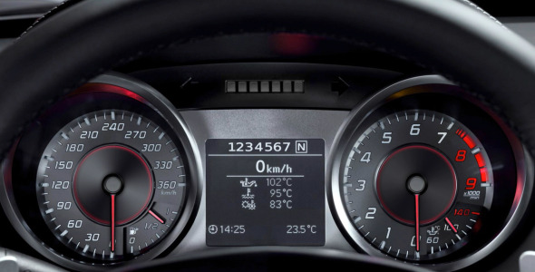
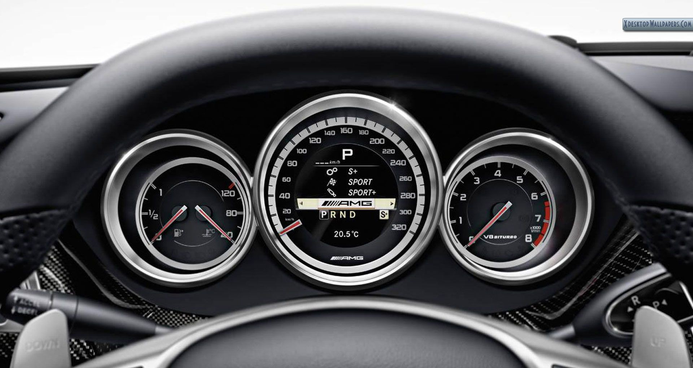
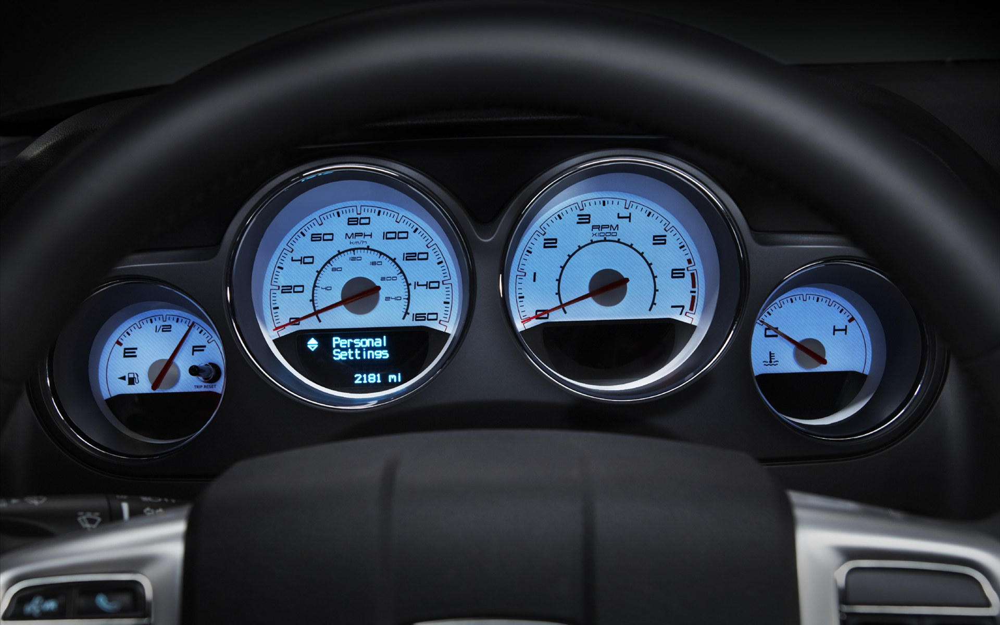

# Car dashboard implementation

## Components
* Speedometer (gauge)
* Fuel (w/ remaining kms?)
* Odometer (km counter) - using BasicDisplay
* Current shift - using BasicDisplay
* Speedometer (absolute value) - using BasicDisplay
* Clock
* Thermometer (environment temperature)
* Tachometer (rotation counter)
* Thermometer (engine temperature)

## Car controls
* **[Arrow Up]** Accelerate
* **[Arrow Down]** Brake

------------

## Implementation phase

The main focus of the implementation phase of this dissertation project will be creating the necessary widgets to simulate a car dashboard.

### Description of the model

The image shown above was to chosen to serve as a model of the prototype being developed.
This prototype can be divided in 4 main sets of components: the left circle, the right circle, the central dashboard, and other components.

#### Left circle
The left circle consists of two main components: 
 * *Speedometer gauge*: which shows the current speed of the car in a graphical shape.
 * *Remaining fuel*: also represented graphically by a gauge.

#### Right  circle
The right circle also consists of two main components: 
 * *Tachometer*: a gauge that displays the current rotations of the car.
 * *Engine temperature*: a thermometer also represented by a gauge.

#### Central dashboard
The central dashboard is composed by several components:
 * *Odometer*: displays the distance (in kilometers) the car has ever travelled.
 * *Current Gear*: displays the current gear of the car.
 * *Speedometer (absolute value)*: displays the current speed of the car as an absolute value.
 * *Three temperature indicators*: Three thermoters that display important car temperatures (TODO change this !!).
 * *Clock*: a clock showing the current time in hours and minutes.
 * *Environment temperature*: An indicator of the current environment temperature.

#### Other dashboard components
There are also some dashboard components aside the ones described and grouped above:
* *The steering wheel*: The steering wheel allows to change the direction of the car.
* *Parking sensors*: The parking sensors display the proximity of a car with an obstacle.
* *Turning lights*: Displays the turning lights of the car - if they have been activated.

## Development process

The implementation of the dashboard was guided by two main goals:

**Reuse as many existing widgets as possible**: In order to avoid code repetition, the first main goal was to reuse the widgets that PVSio-web provides for prototype construction.

**Develop widgets that can later be reused by other PVSio projects**: When building new widgets, the main goal is to make them reusable in future projects.

With these two principles in mind, the components described above will be implemented using the following widgets:

 * Speedometer - Gauge (new widget).
 * Remaining fuel display - Gauge (new widget).
 * Tachometer - Gauge (new widget).
 * Engine temperature - Gauge (new widget).

Central Panel widget:
 * Odometer - BasicDisplay (using existing widget).
 * Current Gear - BasicDisplay (using existing widget).
 * Speedometer (absolute value) - BasicDisplay (using existing widget).
 * Three temperature indicators - BasicDisplay (using existing widget).
 * Clock - BasicDisplay (using existing widget).
 * Environment temperature - BasicDisplay (using existing widget).

Other components:
 * The steering wheel - ?
 * Parking sensors - ?
 * Turning lights - ?

### Implementation of Gauge widget

The implementation of the gauge widget was based on an existing library - [d3-gauge-plus.js](https://github.com/gimbo/d3-gauge-plus "D3 gauge plus"). This library allowed to jump start the gauge displaying. Most of the work on this widget surrounded the need of configuring its design, in order to make it more similar to different styles of dashboards.

TODO describe a lot more here

### Implementation of Central Panel widget

In order to build the central area of the model dashboard, a Central Panel widget was implemented. This widget is composed of multiple BasicDisplay widgets, and is responsible for controlling the style of the smaller widgets, as well as its organization. 

TODO describe a lot more here

### Testing the configurability of the widgets implemented

In order to test the reusability of the widgets implemented, they were used to model the 4 car dashboards presented above. The final result can be seen below: